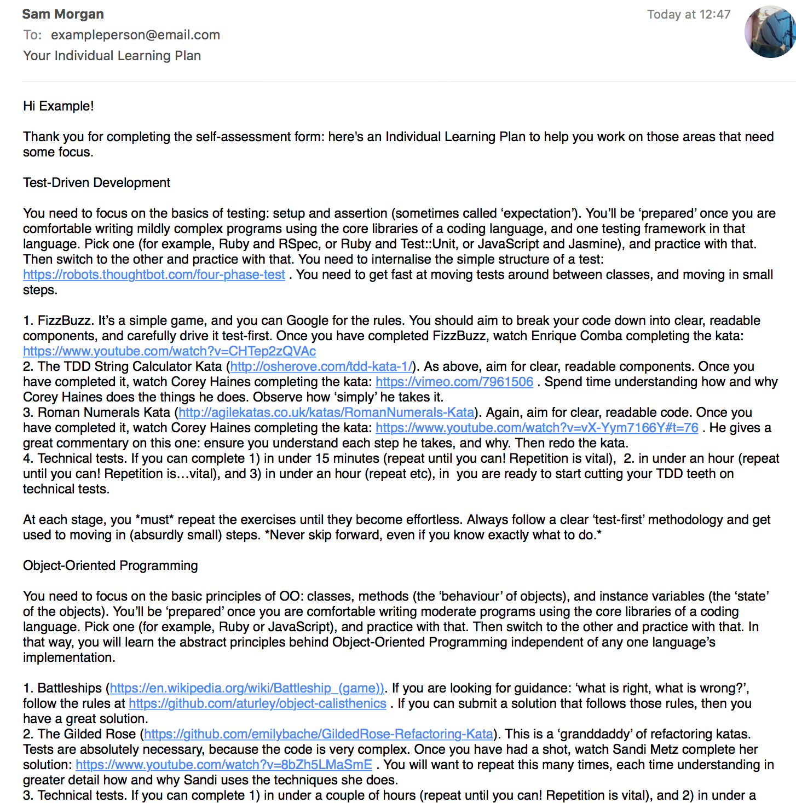

# Individual Learning Plan Mailer

Mails individual learning plans to users.

## Getting Started

- `bundle install`
- Fill out a `.env` file using the template of the `.env.example`
- [Allow access to your Gmail for less secure apps](https://support.google.com/accounts/answer/6010255)
- Copy-paste the relevant rows from [the ILP response sheet](https://docs.google.com/a/makersacademy.com/spreadsheets/d/1O9v22c_G3Lzu38Z8JaDrTh_wSs8Cs7rF30KkRkhaDR0/edit?usp=sharing) (requires Makers Academy login) into `data/list.txt` (remember to clear out any existing data in `data/list.txt` first!)
- Run the program using `ruby run.rb` and follow the instructions.

## How does it work

To get the best overview:

- Open up [the Focus Areas form](https://docs.google.com/a/makersacademy.com/forms/d/e/1FAIpQLSfN8hZHqkEiEncQ6Hq9LDcl8SutladBUPv_JYzE-cEHAlqDYA/viewform) (does not require login, but this is a Makers Academy internal tool so no messin', please).
- Open up [the ILP response sheet](https://docs.google.com/a/makersacademy.com/spreadsheets/d/1O9v22c_G3Lzu38Z8JaDrTh_wSs8Cs7rF30KkRkhaDR0/edit?usp=sharing) (requires Makers Academy login).
- Open up run.rb.
- Have a read of these three things before proceeding.

There are two data files: data/focus_areas.txt and data/list.txt. At runtime, these two files are parsed into objects in the program, via `Users.build` and `FocusAreas.build`. This is the shakiest part of the program, because Google Sheets is somewhat flaky in its copy-pasting of rows and columns.

The program will raise handy errors if there's an error in the parsing. Useful rules-of-thumb:

- If there's an error in the `name`, check that the line in data/list.txt has **two spaces** between the date and the name.
- If there's an error in the `email`, check that the user entered a valid email (at the time of writing, Google Forms doesn't validate emails).

After parsing the data and taking the name of the coach who's sending the email, the program connects to Gmail using the data provided in the `.env` (set up under _Getting Started_ above) and sends emails containing a greeting, a list of focus areas for that student, and a signoff. An example email is at the bottom of this page.

### The data files

#### `data/list.txt`

This is copy-pasted straight from [the ILP response sheet](https://docs.google.com/a/makersacademy.com/spreadsheets/d/1O9v22c_G3Lzu38Z8JaDrTh_wSs8Cs7rF30KkRkhaDR0/edit?usp=sharing) (requires Makers Academy login). It should be ready-to-go just from a copy-paste.

The program will email everyone on the list, customised to their responses.

#### `data/focus_areas.txt`

This is a plain text file containing some guidance appropriate for each focus area the user filled in on the form. The email to each user is mainly composed of this stuff.

You can edit it if you like, and please do submit a PR if you think you've got a better plan than exists there currently.

The guidance is intended to:

- Provide structure (that's why it's kind of 'bootcamp-y'): it should be a cure to the "it's 10am, I've just gotten up, I don't know how to start my day" feeling that can sap empowerment post-Makers. There are suggested times so jobhunters have targets to aim for, and feelings of achievement if they succeed.
- Actually improve basic skills. At current it's composed of three tiered tasks that roll on from one another.

### Example email

